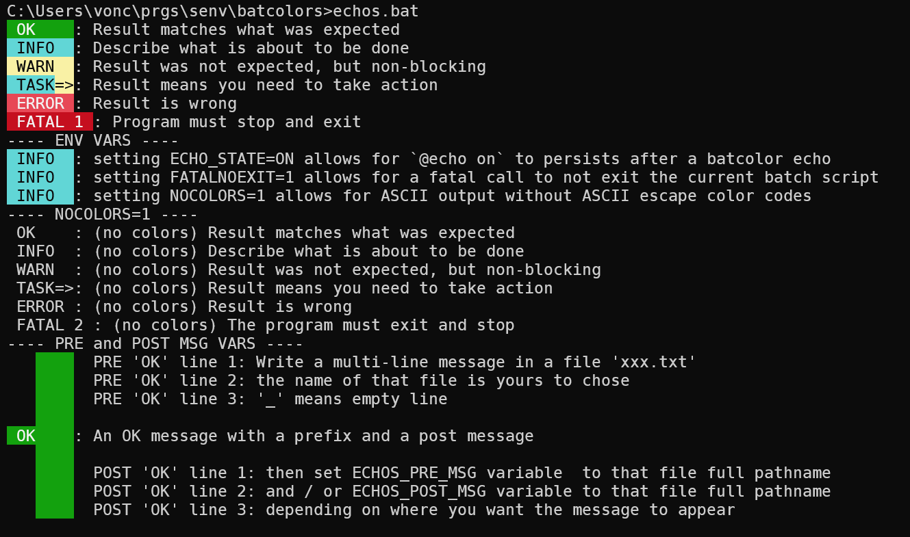

# batcolors
Levels of color used in a Windows bat script

Type `echos` or `echos.bat` in the root folder of this repository, and you get a demo:



## Description

Add log-level-like colored headers to your script output:

## Usage

Clone `batcolors` into your bat script project and:

```bat
@echo off
setlocal enabledelayedexpansion

rem https://stackoverflow.com/questions/112055/what-does-d0-mean-in-a-windows-batch-file
for %%i in ("%~dp0.") do SET "script_dir=%%~fi"
set script_dir=%script_dir%\..
@echo %script_dir%

call %script_dir%\batcolors\echos_macros.bat

%_ok%      "Result matches what was expected"
%_info%    "Describe what is about to be done"
%_warning% "Result was not expected, but non-blocking"
%_error%   "Result is wrong"
%_fatal%   "Program must stop and exit" 1

REM final echo should not be displayed:
echo done
```

`%_error%` will not exit your script, while `%_fatal%` will.  
Any line *after* `%_fatal%` will not be executed (unless `FATALNOEXIT` is set. See below)


### NOCOLORS

If you do not want [ANSI escape code](https://en.wikipedia.org/wiki/ANSI_escape_code), simply `set NOCOLORS=1`.

Then unset it (`set NOCOLORS=`), and the next `%_ok/info/...%` call will display colors again.

### ECHOS_OFF

Setting `ECHOS_OFF=1` will disable all echos (no OK, INFO, WARNING, TASK or ERROR message), except the FATAL one.

Then unset it (`set ECHOS_OFF=`), and the next `%_ok/info/...%` call will display messages again.

### FATALNOEXIT

If you don't want to exit on a `%_fatal%` call, `set FATALNOEXIT=1` first.

Then, unset it (`set FATALNOEXIT=`), and the next `%_fatal%` call will exit the script.

### PRE-POST multi-line messages

If you want to display a multi-line message, use `%_pre%` and `%_pro%` macros to define multiline pre or post messages

```bat
%_post% POST INFO line 1: Write a post-message after the INFO message
%_post% POST INFO line 2
%_info% My INFO message with post lines
```

You can use both `%_pre%` and `%_post%` macros to display lines before *and* after an `%_ok/info/...%`

Or use the file `echos_pre.txt` or  `echos_post.txt` or both: it will be deleted right after the next `%_ok/info/...%`.

```bat
(
echo PRE OK line 1: Write a multi-line message in a file 'xxx.txt'
echo PRE OK line 2: the name of that file is yours to chose
echo PRE OK line 3: '_' means empty line
echo _
) > "echos_pre.txt"
%_ok% " An OK message with prefix lines"
REM The 'echos_pre.txt' file is automatically deleted after any %_ok%, %_info%, %_warning%,... call
```
### export

If you use `call %script_dir%\batcolors\echos_macros.bat export` (with the `export` parameter), it keeps the current context, and does not use `setlocal enabledelayedexpansion`.

Useful when the script is supposed to be called by another one (which has already called `echos_macros.bat`), but you want to call/test that script in standalone:

```bat
if "%script_dir%"=="" (
    for %%i in ("%~dp0.") do SET "script_dir=%%~fi"
    call !script_dir!\batcolors\echos_macros.bat export
)
```

- if not called in standalone, then `script_dir` would not be empty: no need to call `echos_macros.bat` again)
- if called in standalone, then `script_dir` would be empty: call `echos_macros.bat`, again to export its macro definitions in your current content.

### set "ECHO_STATE=ON"

If your script includes a `@echo on`, having `ECHO_STATE=ON` first will make sure the colored echo does not reset the echo mode, keeping it ON.

```bat
cmd /V /C "set "ECHO_STATE=ON" && call your_script.bat"
```

## `[Script name prefix]`

### Prerequisite: define `PRJ_DIR` in your project

The `senv.bat` from your project must define the `PRJ_DIR` variable, which is the root of your project.

The `senv.bat` should include:

```bat
for %%i in ("%~dp0") do SET "PRJ_DIR=%%~fi"
set "PRJ_DIR=%PRJ_DIR:~0,-1%"
for %%i in ("%PRJ_DIR%") do SET "PRJ_DIR_NAME=%%~nxi"

if defined NO_MORE_SENV_%PRJ_DIR_NAME% ( goto:eof )
...
REM your senv.bat project-specific content
...
REM Set project-specific flag when done
set "NO_MORE_SENV_%PRJ_DIR_NAME%=true"
```

Here, the `set "PRJ_DIR=%PRJ_DIR:~0,-1%"` line is important for batcolors to find the `echos.bat` file of batcolors (from within a script from your project), as shown in the next section.

### Use `PRJ_DIR` in a `call_echos_stack` function

Add the following function to your current script, and any `%_ok/info/...%` will start with `[script name.bat] your message...`:

```bat
:call_echos_stack
if not defined ECHOS_STACK ( set "CURRENT_SCRIPT=%~nx0" & goto:eof ) else ( call "%PRJ_DIR%\tools\batcolors\echos.bat" :stack %~nx0 )
goto:eof
```

Adjust the `%PRJ_DIR%\tools\batcolors` path to where your batcolors repository is cloned.

When running your scripts with their own `call_echos_stack` function, you will see the script name in the output, as in this example:

```bash
 OK    : [init.bat] Submodule already initialized
 OK    : [senv.bat] project 'cplx' senv activated [local preserved]: PRJ_DIR='C:\Users\VonC\git\cplx'
 INFO  : [t_build.bat] build_params for build: ''
 INFO  : [t_build.bat] build_params for update-version (rel for 'make release'): ''
 TASK=>: [update-version.bat] Must get version from 'C:\Users\VonC\git\cplx\version.txt'
 OK    : [update-version.bat] version '0.2.0-SNAPSHOT' found in 'C:\Users\VonC\git\cplx\version.txt'
 ```

Each script (`senv.bat`, `t_build.bat`, `update-version.bat`, ...) has the same `:call_echos_stack` in their respective file.

## Callstack ("Stack")

If you use `set "ECHOS_STACK=true"`, those same script-name prefixed message will be displayed with indentation reflecting the callstack.

Example:

```bash
 OK    :   ⁅init.bat⁆ Submodule already initialized
 OK    : ⁅senv.bat⁆ project 'cplx' senv activated [local preserved]: PRJ_DIR='C:\Users\VonC\git\cplx'
 INFO  : ⁅t_build.bat⁆ build_params for build: ''
 INFO  : ⁅t_build.bat⁆ build_params for update-version (rel for 'make release'): ''
 TASK=>:   ⁅update-version.bat⁆ Must get version from 'C:\Users\VonC\git\cplx\version.txt'
 OK    :   ⁅update-version.bat⁆ version '0.2.0-SNAPSHOT' found in 'C:\Users\VonC\git\cplx\version.txt'
 INFO  :   ⁅update-version.bat⁆ is_snapshot='1', is_release='', version_release='0.2.0'
```

This is slower (each message takes more time to be displayed), but it can help debug the callstack of multiple bat scripts.

## License: MIT

[LICENSE](LICENSE)
